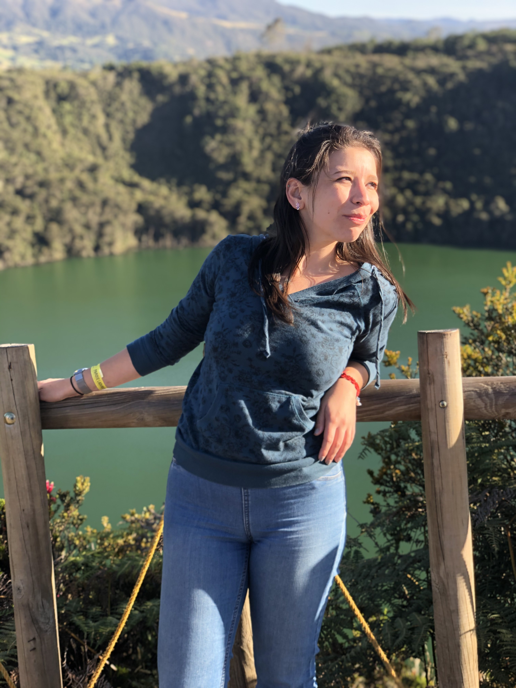

## About me 

As a forensic anthropologist from Colombia, I have experience supporting investigative processes related to the location, recovery, analysis, and identification of victims in the context of armed conflict and criminal cases. In addition, I have actively contributed to humanitarian forensic initiatives in response to mass casualty events and provided international technical assistance in forensic interventions in natural disasters. 

As a PhD student, I am interested in further developing methodological approaches to the analysis of gunshot trauma to improve their utility for forensic science and criminal justice practitioners. In the Spake Lab, I have been working on the implementation of CT scan imaging for gunshot wound analysis in bones.

If you'd like to learn more about me and my work, please check out the resources below:

  + [ResearchGate](https://www.researchgate.net/profile/Alexandra-Semma)
  + [News article about my research](https://www.binghamton.edu/news/story/4854/reading-the-bones-experiment-explores-the-impact-of-gunshots-on-legs-and-arms)

 

