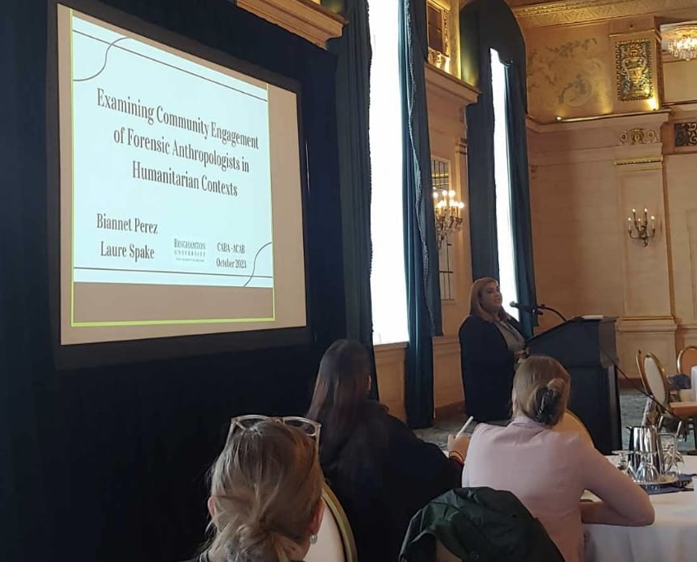

## About me 

As a forensic anthropologist in training, I am interested in the application of  forensic anthropological methods to victim identification in post-atrocity settings. Furthermore, I am interested in a  community-engaged forensic anthropology that serves surviving communities when helping clarify past events of human rights violations and mass atrocities. My research is focused on understanding how forensic anthropologists engage with surviving communities, and how such communities assess the work conducted by forensic anthropology teams. I obtained my certificate in Genocide and Mass Atrocity Prevention in order to incorporate prevention strategies when working in post-conflict and post-atrocity settings. My master’s thesis is focused on examining the work of previous forensic anthropology teams, so we can learn which strategies benefits surviving communities, and what can be improved when working in post-atrocity settings. In my spare time, I love writing poetry, baking low-carb treats. I also try to incorporate yoga to my workout routine (when it’s possible). My dream is to work with vulnerable communities providing them closure through the restitution of their disappeared loved ones. 

If you'd like to learn more about me and my work, please check out the resources below:

  + [LinkedIn](https://www.linkedin.com/in/maria-biannet-perez)

 

