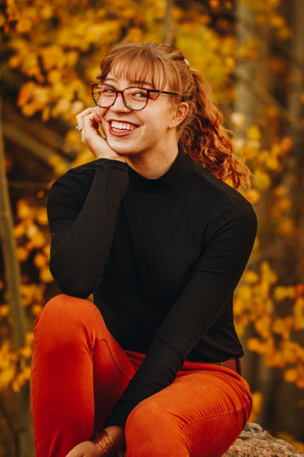

## About me 

As a biological anthropologist, I’m particularly interested in how the cultures and environments we live in impact us physically. My research focuses on bone health, biomarkers, and childhood growth and development, drawing comparisons between two highly active populations in upstate New York and the Gambia. When I’m not in the lab, you can find me cross-country skiing, hiking, or at the local farmers market. 

If you'd like to learn more about me and my work, please check out the resources below:

  + [LinkedIn](http://www.linkedin.com/in/kailee-behunin)
  + [Google Scholar](https://scholar.google.com/citations?view_op=list_works&hl=en&user=zpXGYL0AAAAJ)
  + [ResearchGate](https://www.researchgate.net/profile/Kailee-Behunin)
  + [GitHub](https://github.com/kbehunin)

 

