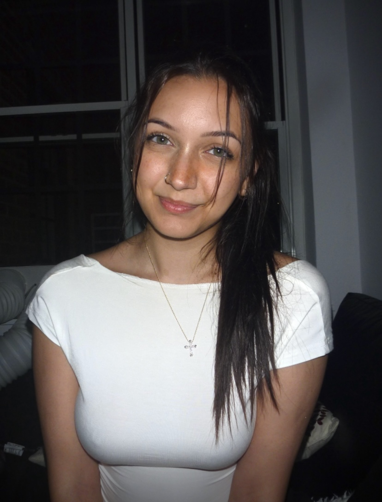

## About me 

As an undergraduate student studying biological anthropology and sociology with a deep interest in global health, my current research in the lab revolves around qualitative data analysis of focus group discussions and in-depth interviews spanning regions like The Gambia, Malawi, India, and the United States. Currently, my undergraduate thesis is focused on genomic research acceptability and bioethical concerns among stakeholders in The Gambia, exploring perspectives on ethical and practical challenges in genomic research, particularly issues surrounding informed consent, limited genomic knowledge, and trust. In my free time, I enjoy drawing and painting, listening to music, and exploring new places.

If you'd like to learn more about me and my work, please check out the resources below:

  + [LinkedIn](www.linkedin.com/in/sarah-caba)
  + [ResearchGate](https://www.researchgate.net/profile/Sarah-Caba)

 

