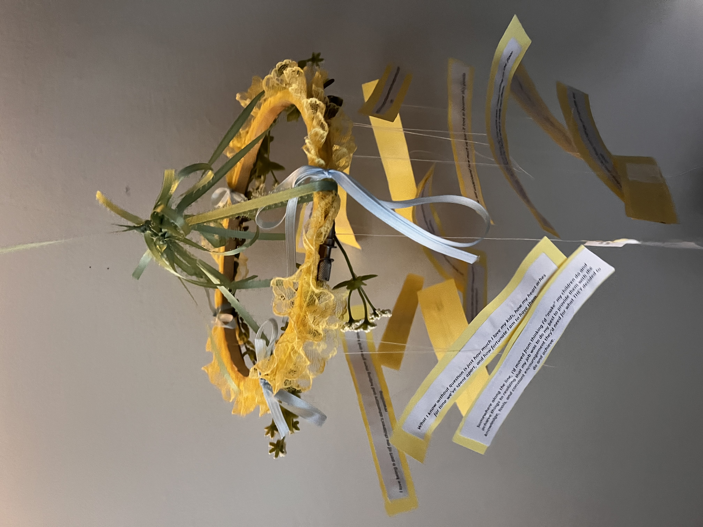
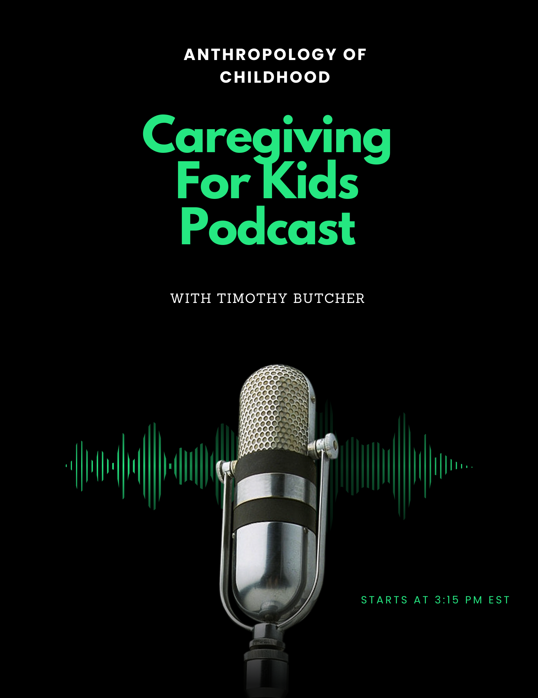
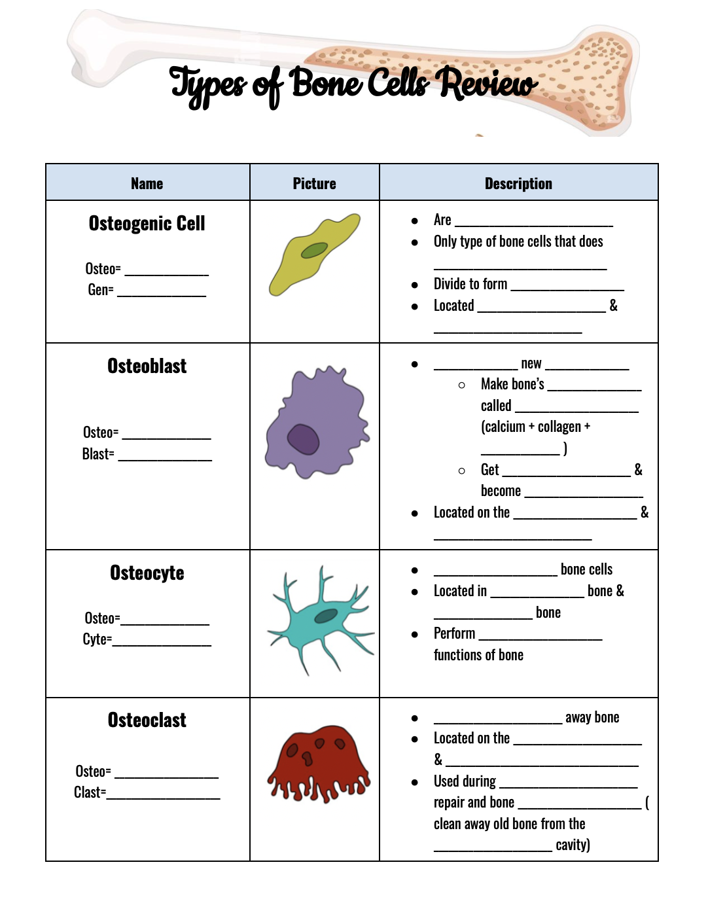
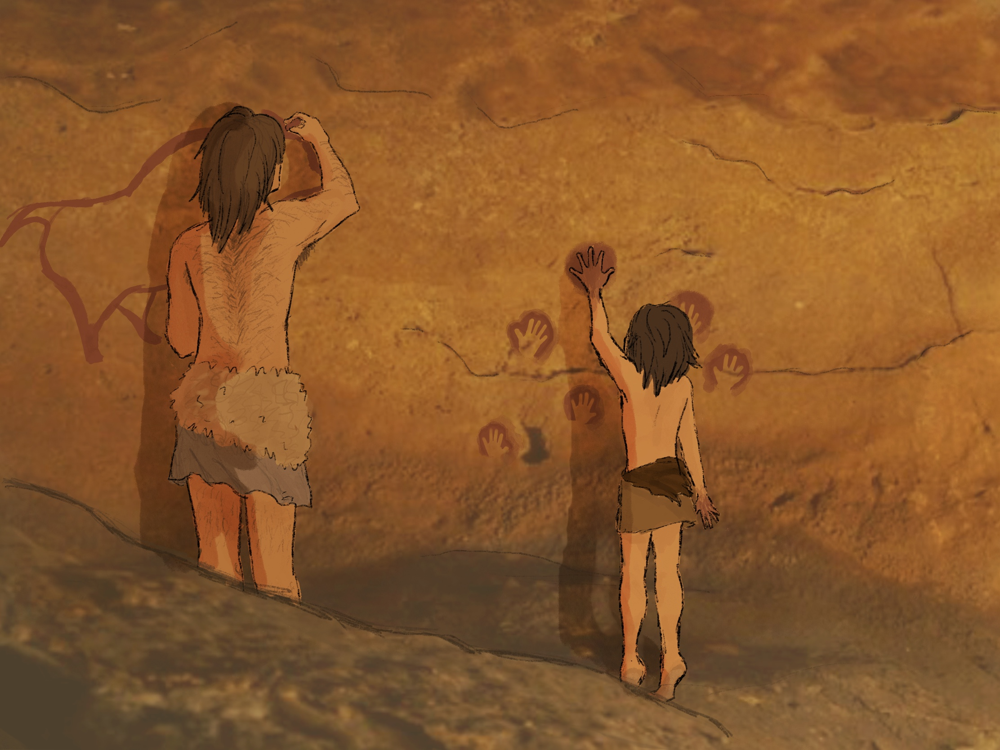
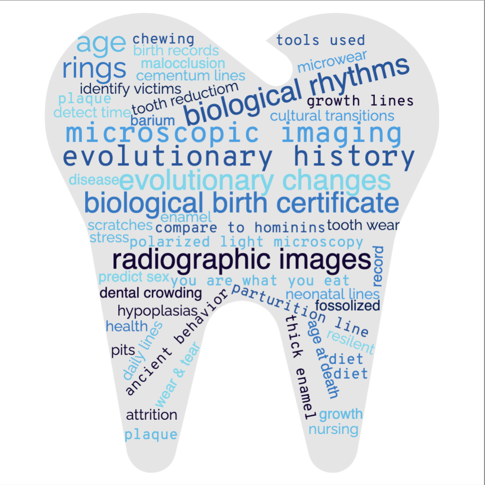

## Course Description

What is a child, and what do humans gain from our unique and extended childhood? This course takes a biocultural perspective on childhood, exploring how the biology and psychology of children interact with cultural practices to create human childhoods. We will explore how anthropologists study childhood across the subdisciplines, variously adopting biological, sociocultural, archaeological, and historical lenses. Through our study of children and their development, we will explore the extent to which both “nature” and “nurture” shape what it means to be a child. We will also reflect on normative North American childhoods as just one of many possible human childhoods.

--- 

## Syllabus 

The syllabus is available [here](https://drive.google.com/file/d/141g0TR4-SvpVY6F2NBSRX3rUW7A5NZdR/view?usp=sharing). It does not yet have readings listed in the schedule, but this should be coming soon! 

---

## Assignments

The bulk of the work for the course consisted of short (300-500 word) written assignments that students completed throughout the semester. The prompts asked students to do things like: deeply read three articles to analyse how much topical and/or citational overlap there was between them; watch short ethnographic films and reflect on cross-cultural variation in parenting; design a school for 6-10 year olds that they think would be best to prepare North American children; perform a material culture survey of two neighbourhoods to interpret the role of children in each setting; reflect on social and legal adulthood in the USA. 

--- 

## Un-Essay Project Examples

The culminating project for this course is an Un-Essay. Students conduct research and instead of writing a paper, they produce a creative work based on their research. Here are some of the projects students have produced for this course. All are shared with permission of the student. The project and its guidelines were inspired by and adapted from Cara Ocobock and Marc Kissel, and are [here](https://drive.google.com/file/d/1HyCBOt23p3QfGfCLk-Dmw72Knkylr5Jk/view?usp=sharing). 

*Some examples of the projects produced by students:*

"A Love Letter to Fatherhood": Research on fatherhood across cultures led a student to interview fathers in her life about what fatherhood meant to them. Read the project narrative [here](https://drive.google.com/file/d/1Ok9Zw-4L1NK_IjRdhR79OVyWG_ly7YyC/view?usp=sharing).

---

"Caregiving for Kids" podcast: Interested by variation in parenting methods, a student interviews parents from different generations to explore how parenting has changed over several generations. Read the project narrative [here](https://drive.google.com/file/d/1kOv_Fa_itJiq2CtBy-XXUwFneiPgIf09/view?usp=sharing) and download the podcast [here](https://drive.google.com/file/d/1RoKPBMXopC--7yKmdQnP2QtJy3QUhuNy/view?usp=sharing)

---

"Bone tissue and functions" lesson plan: Motivated by her experience of a bone fracture, a student designed a lesson plan and teaching materials to teach high schoolers about bone cells and how they lay down bone. Read the project narrative [here](https://drive.google.com/file/d/1vvzg19ei_j2J8zTsNyu0tRN9GM8mN52t/view?usp=sharing). You can also download the project products: here are the [lesson plan](https://drive.google.com/file/d/1StkP_1e9Eg6iIPzEhBuJe8NO3cyWyvE6/view?usp=sharing), [teaching powerpoint](https://drive.google.com/file/d/161Fa6WoOY_kdAS4ozR8e3sPhwp2mGsS0/view?usp=sharing), and the [active learning worksheet](https://drive.google.com/file/d/1hVxWMI64hVVOPFGXo_7L8iDzduo_t6s2/view?usp=sharing).

---

Inspired by parietal art and children's participation in creating it, a student created an illustration of a child learning to paint in the LOPI (learning by observing and pitching in) model of learning. Read the project narrative [here](https://drive.google.com/file/d/12iBUEoHD1oc6DVCFy4m4F6YVIb95aBAV/view?usp=sharing)

---

Interested in learning about what teeth can tell you about a person, a student read Tanya Smith's "The Tales Teeth Tell" and created a wordcloud highlighting some of they key concepts in the text. Read the project narrative [here](https://drive.google.com/file/d/1vSw0m0lnlHN8Cp1QcW9suoylHpolrnzP/view?usp=sharing)

---