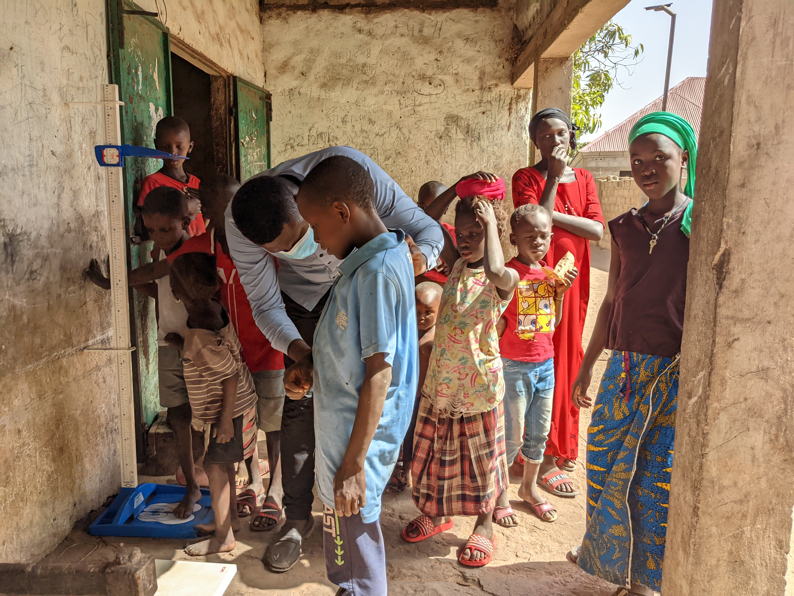

---

A core component of our research is anthropometrics, or measurements of the body. This photo was taken in West Kiang, the Gambia, during data collection for the [Evolutionary Demography of Religion Project](https://www.evolutionarydemographyofreligion.org/).  