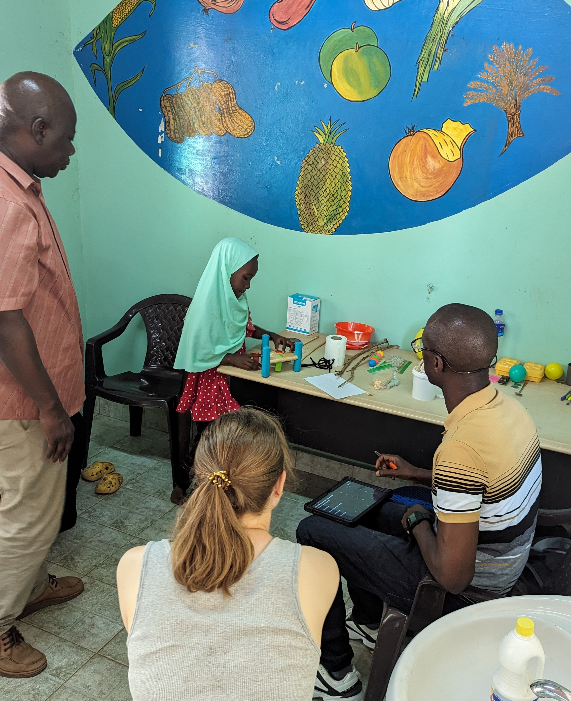

---

As part of the second wave of data collection for the [Evolutionary Demography of Religion Project](https://www.evolutionarydemographyofreligion.org/), our team collected higher quality measures of child and maternal wellbeing. One of these measures was child development, assessed by the [Malawi Developmental Assessment Tool](https://journals.plos.org/plosmedicine/article?id=10.1371/journal.pmed.1000273). This tool allows us to assess development along four major axes (fine motor, gross motor, language, and social skills) in children up to the age of 6 years. Here, our team of nurses works together to assess fine motor skills in a child enrolled in the study.   