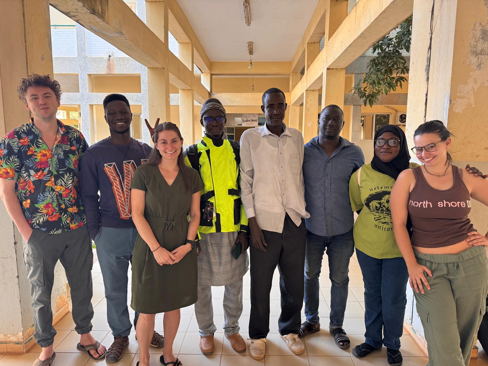

---

As part of the Need To Know Basis (NTKB) project, Dr. Spake, Julie, and Luke (Baylor) worked with MRCG field team to collect data about FGC and cooperation in the Farafenni region, North Bank district, The Gambia. 