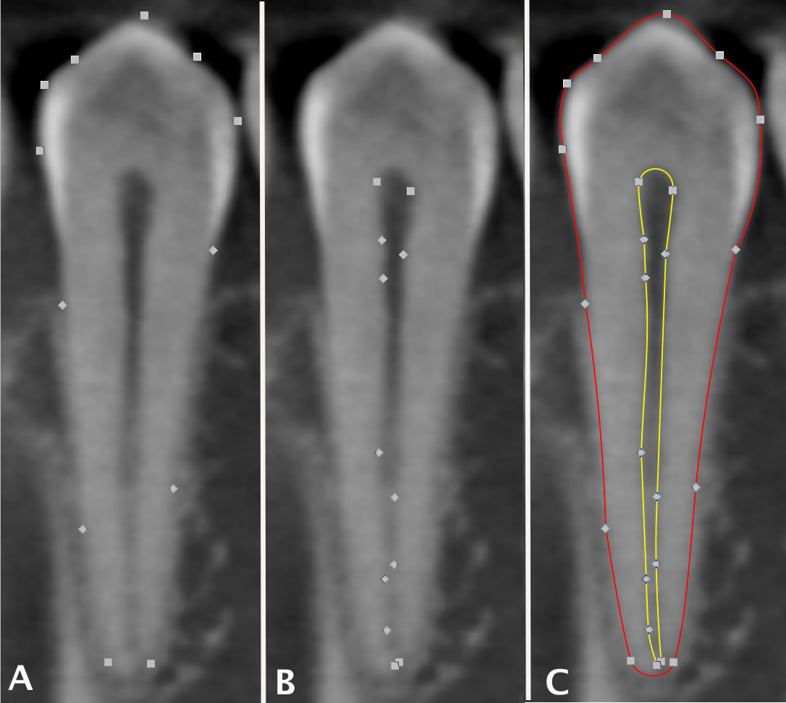

### DentinAge

Since 2024, our group has been working a collective project testing the potential utility of secondary dentine deposition as a method for age estimation in adults. 

Specifically, we are interested in the performance of pulp:tooth ratio, which can be measured in two or three dimensions. Age estimation methods derived from these metrics have been developed for many population and this method's popularity is growing in forenic practice in the US.

Goal: The project aims to test the methods and their underlying assumptions about the relationship between age and progression of secondary dentine deposition.

### Project status

We teamed up with a dental practice in the greater Binghamton area to collect more than 150 anonymized cone-beam computed tomography (CBCT) scans of the mandibular dentition for adults in the 18-95 year age range.  

Over AY 2024-2025, our team measured these scans for 2D pulp:tooth area ratio in the canine and pre-molars. We used these measurements to test the performance of the Cameriere et al. (2007)[https://doi.org/10.1111/j.1556-4029.2006.00336.x] and (2012)[https://doi.org/10.1016/j.forsciint.2011.07.028] methods, by far the most popular of such methods. In Spring 2025, we used the Paper In A Day co-writing model to produce a manuscript from this work, which was recently published in [Forensic Science International](https://doi.org/10.1016/j.forsciint.2025.112674).

Over AY 2025-2026, our team worked to request access to 2D pulp:tooth area ratio data from global populations. We are currently analyzing these data to examine cross-population variation in secondary dentine deposition. We are also working on fine tuning segmentation models for 3D volumetric calculation of the pulp:tooth volume ratio.

Stay tuned for more!

### Selected publications from this project

Semma Tamayo A, MB Perez, Behunin K, Caccavari C, Robinson N, Spake L. 2026. Validity and reliability of the pulp/tooth area ratio for age estimation in adults: A test of the Cameriere et al. methods in a U.S. population. Journal of Forensic Sciences 378:112674. DOI: [10.1016/j.forsciint.2025.112674](https://doi.org/10.1016/j.forsciint.2025.112674).

### Selected conference presentations from this project

Perez MB, Semma Tamayo A, Behunin K, Caccavari C, Robinson N, Spake L. A test of the Cameriere et al. pulp/tooth area age estimation method in a U.S. population. AAFS, New Orleans.

Semma Tamayo A, Perez B, Behunin K, Caccavari C, Robinson N, Spake L. Adult forensic age estimation from secondary dentine deposition: A test of the pulp/tooth ratio method in a U.S. population. CABA, London, ON.

