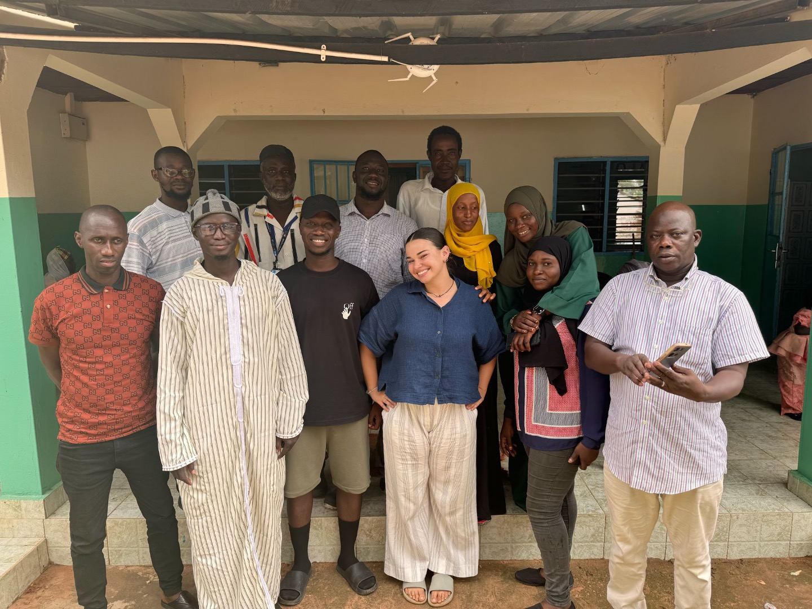

### The Evolutionary Demography of Religion

Our team collaborates on the Evolutionary Demography of Religion project, a mixed-method cross-cultural project. Learn more about the project and the full team [here](https://www.evolutionarydemographyofreligion.org/).

Goal: In post-industrial societies, the number of children in a family is negatively correlated with each child's success. In these same settings, religious families tend to have more children than their secular counterparts - and yet children from religious families do not exhibit the negative consequences of larger family sizes. The project team hypothesizes that religious families are able to achieve this through increased collaboration with each other, particularly in the form of childcare.

The project is funded by the John Templeton Foundation and the Templeton Religion Trust, grants awarded to project PIs: John Shaver, Richard Sosis, Rebecca Sear, and Mary Shenk.

### Project status

The first round of data collection across all five study settings is complete. 

In summer 2024, our team launched a second wave of data collection in The Gambia. In this wave, we re-visited a subset of our participants and their children, focusing on collection additional and higher-resolution measures of both maternal and child wellbeing. Multiple students working with the lab contributed to this wave of data collection.

Several lab members are actively contributing to data analysis from this project.

### Selected publications from this project

Shaver JH, Chvaja R, Spake L, Prentice AM, Cerami C, Badjie J, Sear R, Shenk MK, Sosis R. 2024. Religious involvement is associated with higher fertility and lower maternal investment, but more alloparental support among Gambian mothers. American Journal of Human Biology. DOI: [10.1002/ajhb.24144](https://doi.org/10.1002/ajhb.24144).

Spake L, Schaffnit SB, Page AE, Hassan A, Lynch R, Watts J, Sosis R, Sear R, Shenk MK, Shaver JH. 2024. Religious women receive more allomaternal support from non-partner kin in two low-fertility countries. Evolution and Human Behavior. DOI: [10.1016/j.evolhumbehav.2024.04.001](https://doi.org/10.1016/j.evolhumbehav.2024.04.001). 

Spake L, Hassan A, Schaffnit SB, Alam N, Amoah AS, Badjie J, Cerami C, Crampin A, Dube A, Kaye MP, Kotch R, Liew F, McLean E, Munthali-Mkandawire S, Mwalwanda L, Petersen AC, Prentice A, tuz Zohora F, Watts J, Sear R, Shenk MK, Sosis R, Shaver JH. 2024. A practical guide to cross-cultural data collection in the human behavioural sciences: Insights from the Evolutionary Demography of Religion project. Proceedings of the Royal Society B: Biological Sciences 291:20231422. DOI: [10.1098/rspb.2023.1422](https://doi.org/10.1098/rspb.2023.1422).

Hassan A, Spake L, Shaver J, Sosis R, Shenk M, Sear R. Nuclearization of mothers’ social support and childcare provision networks in the UK and the USA during the COVID-19 pandemic. Social Science & Medicine DOI: [10.1016/j.ssaho.2024.100932](https://doi.org/10.1016/j.ssaho.2024.100932).

Schaffnit SB, Lynch R, Spake L, Sear R, Sosis R, Shaver J, Alam N, Blumenfield T, Mattison S, Shenk M. 2023. The impact of market integration on arranged and love marriages in Matlab, Bangladesh. Evolutionary Human Sciences 5:e5. DOI: [10.1017/ehs.2022.54](https://doi.org/10.1017/ehs.2022.54).

Spake L, Schaffnit SB, Sear R, Shenk M, Sosis R, Shaver JH. 2021. Mothers’ partnership status and allomothering networks in the United Kingdom and United States. Social Sciences 10:182. DOI: [10.3390/socsci10050182](https://doi.org/10.3390/socsci10050182). 

### Selected conference presentations from this project

Taiwo I, Caba S, Hassan A, Spake L. 2024. Exploring maternal health information seeking behavior and proposing empowering solutions for improved healthcare outcomes. NYSPHA, Saratoga Springs NY.

Taiwo I, Caba S, Sear R, Shaver JH, Shenk MK, Sosis R, Spake L, Hassan A, and the EvoDemReligion Team. 2024. What is a father’s role? Men’s perspectives on their contributions to raising children in The Gambia and Malawi. EHBEA, Montpellier, France.

Hassan A, Taiwo I, Caba S, Sear R, Shaver JH, Shenk MK, Sosis R, Spake L, and the EvoDemReligion Team. 2024. Who informs childraising decisions? Variation in the sources of information parents value across cultures. EHBEA, Montpellier, France.

Hassan A, Sear R, Spake L, Schaffnit S, Chvaja R, Shaver J, & The Evolutionary Demography of Religion Team. 2023. Allomothering networks in cross-cultural perspective: who helps mothers and what do they help with? BSPS, Keele, UK.

Spake L, Hassan A, Badjie J, Sear R, Shenk MK, Sosis R, Shaver JH. 2022. Provisioning, but not other types of allomothering, may promote healthy growth in children. AAA, Seattle.

### Photos from wave 2

