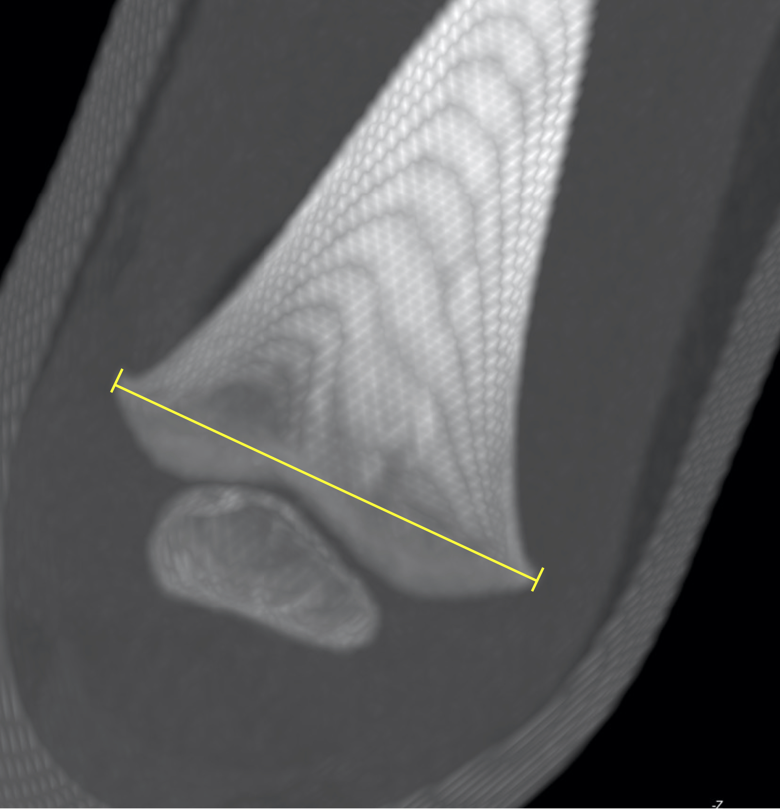

### Estimating the juvenile biological profile

Goal: The purpose of this project is to develop and test methods for estimating various parameters of the juvenile biological profile for use in both bioarchaeological and forensic contexts. What methods do practitioners need? Should we develop population specific or universal methods? How well do existing methods perform across target population? Key collaborators include Hugo Cardoso (SFU) and John Albanese (UWindsor).

Data for these studies include: skeletal data from CT scans of children from the US; skeletal measurements and dental x-rays from identified skeletal collections across the Europe and the US. 

### Project status

Work on this topic is ongoing. Data has largely been collected, although there are opportunities for students to do additional data collection. There may also be opportunities for students to analyze these data.

### Publications from this project

Murray NJ, Spake L, Cervantes M, Albanese J, Cardoso HFV. 2024. New More Generic and Inclusive Regression Formulae for the Estimation of Stature from Long Bone Lengths in Children. Forensic Sciences 4(1):62-75. DOI:[https://doi.org/10.3390/forensicsci4010005](https://doi.org/10.3390/forensicsci4010005)

Spake L, Meyers J, Cardoso HFV. 2021. Juvenile body mass estimation from the femur using postmortem computed tomography data. Human Biology 93(2):4.[Pre-print](https://digitalcommons.wayne.edu/humbiol_preprints/188).

Lamer M, Spake L, Cardoso HFV. 2021 Testing methods for juvenile sex estimation using long bone metaphyseal and diaphyseal measurements. Forensic Science International 321:110739. DOI: [10.1016/j.forsciint.2021.110739](https://doi.org/10.1016/j.forsciint.2021.110739).

Cardoso HFV, Spake L, Humphrey LT. 2017. Age estimation of immature human skeletal remains from the dimensions of the girdle bones in the postnatal period. American Journal of Physical Anthropology 163:772-783. DOI: [10.1002/ajpa.23248](https://doi.org/10.1002/ajpa.23248).

Cardoso HFV, Spake L, Liversidge HM. 2016. A reappraisal of developing permanent tooth length as an estimate of age in human immature skeletal remains. Journal of Forensic Sciences 61:1180-1189. DOI: [10.1111/1556-4029.13120](https://doi.org/10.1111/1556-4029.13120).

### Selected conference presentations from this project
_italics = lab student author_

*Behunin K, Caccavari C*, Cardoso HFV, Spake L. 2023. Can diaphyseal shape variables improve the reliability of juvenile age estimation methods applied across populations? Canadian Association of Biological Anthropologists, Winnipeg.