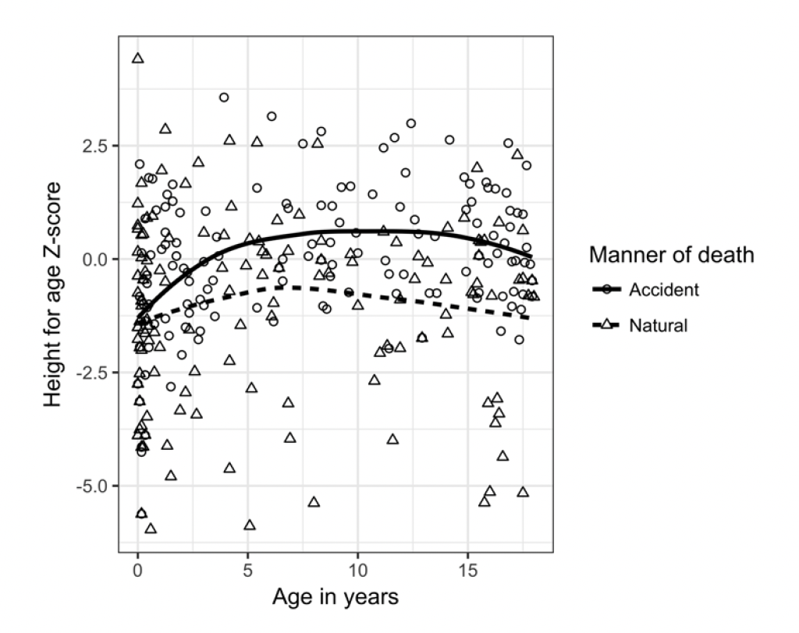

### The impact of biological mortality bias in growth on bioarchaeological interpretations of past populations

Goal: The purpose of this project is to reflect on the likely magnitude of mortality bias in growth in the past. Are archaeological skeletal samples of juveniles representative of their living peers? Is this representativeness or lack thereof even across populations? Within a population, is the bias stable across age groups and between the sexes?

Data for this study include: skeletal and dental development data from CT scans of children from two sites, one in the US and one in Australia; full body cadaveric measurements from a medicolegal institution in the US; and historical records from a Portuguese tuberculosis sanatorium.

### Project status

This project comprised Laure Spake's doctoral research. Empirical findings from the dissertation have been published, but I am continuing to think about these topics and how to quantify mortality bias in new and innovative ways.

### Funding information

This project was supported by grants from Mitacs Canada (Globalink IT13950) awarded to Laure Spake, the Natural Sciences and Engineering Research Council of Canada (NSERC RGPIN-201-05863) awarded to Hugo Cardoso, and the Department of Archaeology at Simon Fraser University awarded to Laure Spake.

### Publications from this project

Spake L, Hoppa RD, Blau S, Cardoso HFV.2022. Mortality bias in diaphyseal growth in juveniles: Implications for paleoauxology. American Journal of Physical Anthropology 178:89-107. DOI: [10.1002/ajpa.24486](https://doi.org/10.1002/ajpa.24486).[Read more on the publication page](https://laurespake.netlify.app/pub/spake-22-mortbias-2/)

Spake L, Blau S, Cardoso HFV. 2021. The impact of forensic mortality bias in juvenile forensic age estimation. European Journal of Anatomy 25:129-146. Publication page coming soon.

Spake L, Hoppa RD, Blau S, Cardoso HFV. 2021. Lack of biological mortality bias in the timing of dental formation in contemporary children: implications for the study of past populations. American Journal of Physical Anthropology 174:646-660. DOI: [10.1002/ajpa.24218](https://doi.org/10.1002/ajpa.24218). 

Spake L, Cardoso HFV. 2021. Interpolation of the Maresh diaphyseal length data for use in quantitative analyses of growth. International Journal of Osteoarchaeology 31:232-242. DOI: [10.1002/oa.2942](https://doi.org/10.1002/oa.2942).  
*Note: I have made available a tool associated with this paper which aids in the calculation of z-scores. Download the RScript and instructions for running it on the project [OSF page](https://osf.io/c2x7k/). No R background needed.*

Spake L, Cardoso HFV. 2019 Indirect evidence for biological mortality bias from two temporo-spatially distant samples of children. Anthropologischer Anzeiger 76:379.390. DOI: [10.1127/anthranz/2019/0957](https://doi.org/10.1127/anthranz/2019/0957).

Spake L. 2020. Using anthropometrics and dental formation stages of contemporary children to investigate the impact of biological mortality bias on interpretations of past population health. PhD Dissertation, Simon Fraser University. [Available online](https://summit.sfu.ca/item/20525).
