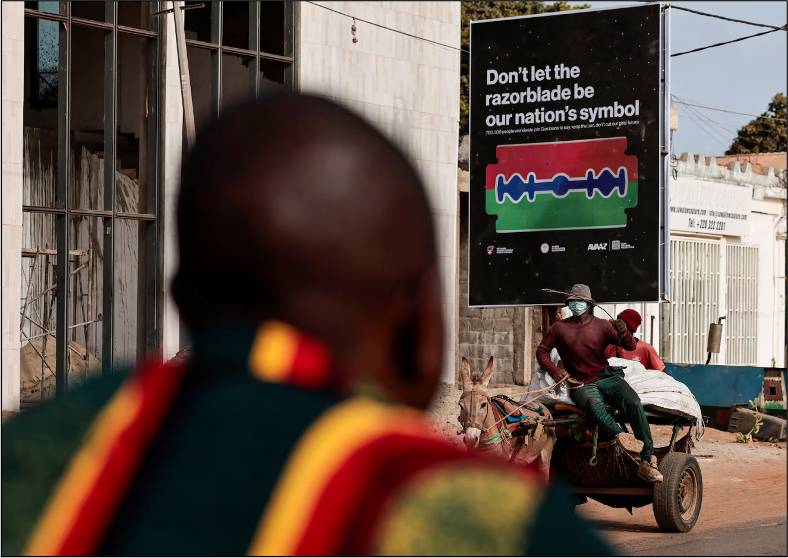

### Need to Know Basis: Understanding Female Genital Cutting

Our team is leading data collection on this mixed-method project. In 2024, the National Assembly in The Gambia considered a bill that would repeal a national ban on female genital cutting which was enacted in 2015. Following the high-profile prosecution of two women under this law in 2023, there has been a lot of debate about whether this law should be in effect. The law was ultimately not repealed. The process, however, generated a lot of debate on the practice both in the media and amongst private citizens.

Goal: Female genital cutting (FGC, also known as FGM or FGM/C) has long been seen as a social norm whose function is to signal a young woman's chastity and future fidelity to her husband, thereby strengthening her chances of making a good match on the marriage market (the marriage convention hypothesis). However, recent work has suggested that this practice is also reinforced by other women, who may refuse to create social relationships with women who are uncut (the peer convention hypothesis). This project will leverage recent national conversations around the (il)legality of FGC in The Gambia to test the relative explanatory power of these two hypotheses. 

The project is funded by an National Science Foundation Cultural Anthropology RAPID grant awarded to Laure Spake, with co-PIs: Katherine Wander, John Shaver, Bettina Shell-Duncan, and Carla Cerami.

*Photo credit: Reuters International*

### Project status

Data collection has started. We are currently planning travel to The Gambia (January 2025) to initiate the next phase of the research. At least two students will be involved in data collection for this project.

### Selected presentations from this project

Spake L. 2024. Combining social norms theory and costly signaling theory to better understand female genital cutting in The Gambia. Social Science Group Meeting, MRCG@ LSTHM, Fajara, The Gambia. 

