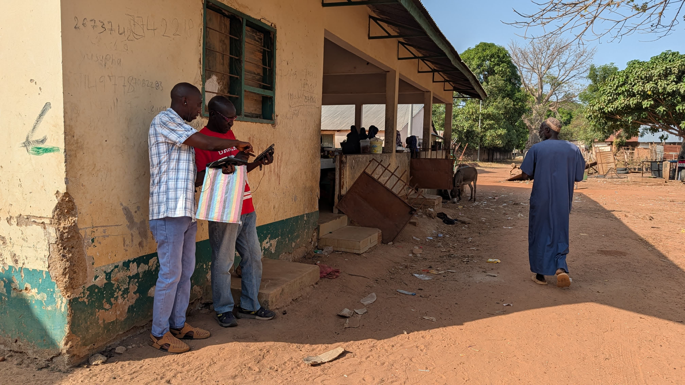

### Proximity Sensing for Social Support Network Reconstruction

Our team is leading data collection on this seed project aimed at developing new tools to improve the study of religion and cooperation. When anthropologists study cooperation in naturalistic settings, two options are generally available for data collection: 1) survey-based recall of behavior; and 2) behavioral observations. Both approaches have non-negligible drawbacks either in terms of data quality or in data collection burden leading to small sample sizes.

Goal: This project leverages new technology, namely proximity sensors ("motes"), to detect interactions between participants residing in a village. List of interactions are then used to help participants recall the nature of the interactions they had the previous day. This enables high-volume and high-quality data collection on large networks of individuals over relatively short period of time.

The project is funded by a SPARRC Seed Grant, awarded by the SCORE Project to John Shaver, Laure Spake, Joseph Bulbulia, Mark Flynn, Rebecca Sear, Mary Shenk, and Richard Sosis.

### Project status

In fall 2025, we conducted a pilot study in collaboration with the Campus Pre-School at Binghamton University. Students in the graduate Growth and Development course assisted with behavioral observations with the pre-school children. In spring 2026, we are spending time in the field fine tuning and testing the method. In summer 2026, collaborators will be testing the method in their respective field sites.

### Selected presentations from this project

Spake L, Wu CP. 2026. Proximity sensing for social support network reconstruction: A pilot study in Kiang West, The Gambia. Data Science TAE Data Salon series, Binghamton University.

