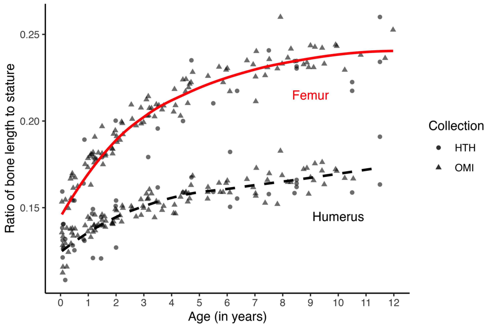

### Abstract:

Existing child stature estimation methods have a number of disadvantages. This paper addresses some of these limitations by developing regression-based stature estimation formulae that are more generic and inclusive. A sample of 142 individuals under 12 years of age from the Hamann—Todd Human Osteological Collection and the New Mexico Decedent Images Database were used to generate five least squares linear regression formulae to estimate stature from the diaphyseal length of long bones. All models showed excellent fits to the data (R2 close to or at 0.98), and internal validation confirmed the stability and accuracy of model parameters. External validation was performed using a sample of 14 individuals from the Lisbon Collection and the Victoria Institute of Forensic Medicine. Overall, the humerus provides the most accurate estimate of stature, but the femur and tibia showed the greatest coverage. These formulae can be used in a variety of contexts and are not dependent on group affiliation, including sex.

