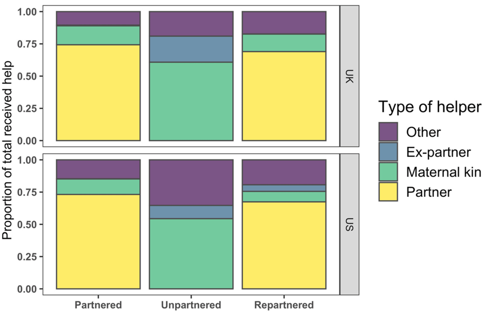

### Abstract:

In high-income, low-fertility (HILF) settings, the mother’s partner is a key provider of childcare. However, it is not clear how mothers without partners draw on other sources of support to raise children. This paper reports the findings from a survey of 1532 women in the United Kingdom and the United States, in which women described who provided childcare for a focal child and how frequently they did so. We use multivariate Bayesian regression models to explore the drivers of support from partners, maternal kin, and other allomothers, as well as the potential impact of allomothering on women’s fertility. Relative to mothers who are in a stable first marriage or cohabitation, mothers who are unpartnered rely more heavily on fewer maternal kin, use more paid help, and have networks which include more non-kin helpers. Repartnered mothers received less help from their partners in the UK and less help from maternal kin in both countries, which US mothers compensated for by relying on other helpers. While repartnered mothers had higher age- adjusted fertility than women in a first partnership, allomaternal support was not clearly related to the mother’s fertility. These findings demonstrate the importance of partners but also of allomothering more broadly in HILF settings. 

