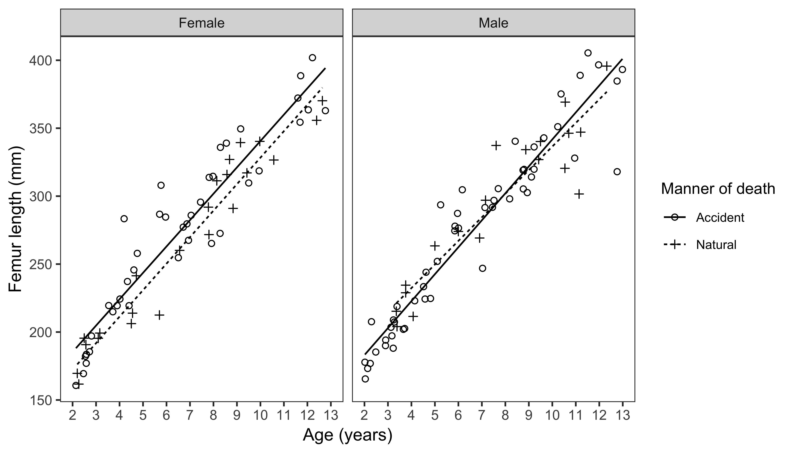

### Abstract:

*Objectives*:
Biological mortality bias is the idea that individuals who comprise skeletal samples (non-survivors) are a specific subset of the overall population, who may have been exposed to greater stress during life. Because of this, it is possible that studying growth in a skeletal population misrepresents the growth and health of survivors in that population. Using a modern sample, this study investigates whether biological mortality bias in growth may be present in archaeological skeletal samples.

*Materials and methods*:
Postmortem computed tomography scans of 206 children aged under 13 years were collected from two institutions in the United States and Australia. The sample was separated into children who died from natural causes as proxies for non-survivors and from accidental causes as proxies for survivors. Differences in long bone length for age were assessed through analysis of covariance (ANCOVA) and z-score analysis, and these results were compared with studies linking anthropometrics and mortality risk in nonindustrialized societies.

*Results*:
Differences in growth favoring survivors were greater for girls than for boys and seemed to increase over age. The effect in nonindustrialized societies was 1.5 to 5 times the magnitude of that in our contemporary sample.

*Conclusions*:
A greater growth delay in girls than in boys has been documented in historical identified collections, and skeletal samples consistently become more stunted relative to modern standards over the course of growth. Our findings on biological mortality bias could explain part of these growth delays and impact interpretations of past ontogenetic environments.

